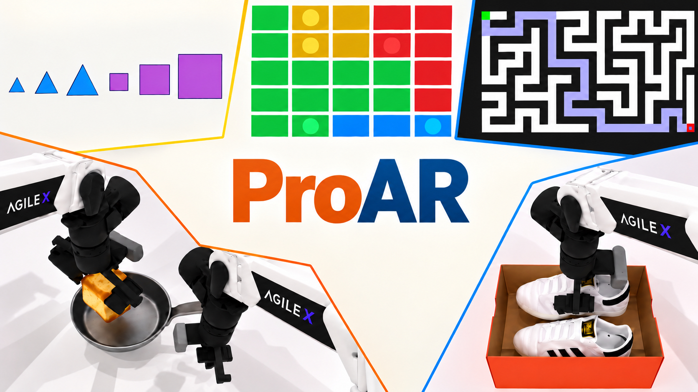

<h1 align="center">ProAR: Learning Prospective Reasoning with Autoregressive Video Models</h1>

<p align="center">
  Linghui Shen<sup>1</sup>,
  <a href="https://darthzhu.github.io/">Tinghui Zhu</a><sup>2</sup>,
  <a href="https://sheng-z.github.io/">Sheng Zhang</a><sup>3</sup>, and
  <a href="https://muhaochen.github.io/">Muhao Chen</a><sup>2,†</sup>
</p>

<p align="center">
  <sup>1</sup>The Hong Kong Polytechnic University &nbsp;&nbsp;
  <sup>2</sup>University of California, Davis &nbsp;&nbsp;
  <sup>3</sup>Microsoft Research
</p>

<p align="center">
  <a href="https://arxiv.org/abs/2610.03664"></a>
  <a href="https://luka-group.github.io/ProAR/"></a>
  <a href="https://github.com/luka-group/ProAR"></a>
  <a href="https://huggingface.co/LinghuiShen/ProAR"></a>
  <a href="https://huggingface.co/datasets/LinghuiShen/ProAR-test"></a>
  <a href="LICENSE"></a>
</p>

<p align="center">
  
</p>

<!-- Replace the arXiv placeholder after its public URL is available. -->

ProAR equips an autoregressive video model with prospective reasoning through two complementary designs:

- **Outcome guidance** jointly predicts a future goal frame and lets the current chunk attend to this goal belief.
- **Transition guidance** uses a training-only predictor to align the current-chunk representation with the clean next-chunk representation.

ProAR addresses reasoning tasks by autoregressively generating a sequence of visual states.

## 🛠️ Installation

### 1. Create the environment

The released environment uses Python 3.10 and PyTorch 2.8.0.

```bash
git clone https://github.com/luka-group/ProAR
cd ar-video-reasoning

conda create -n proar python=3.10 -y
conda activate proar
pip install -r requirements.txt
```

Optional optimized attention kernels can be installed after PyTorch:

```bash
pip install flash-attn==2.8.3.post1 --no-build-isolation
```

### 2. Download the Wan2.2 backbone

All experiments use [Wan2.2-TI2V-5B](https://huggingface.co/Wan-AI/Wan2.2-TI2V-5B). The code expects the following local path:

```bash
hf download Wan-AI/Wan2.2-TI2V-5B \
  --local-dir wan_models/Wan2.2-TI2V-5B
```

The resulting directory should contain `Wan2.2_VAE.pth`, `models_t5_umt5-xxl-enc-bf16.pth`, the DiT weights, and the `google/umt5-xxl/` tokenizer files.

## 🤗 Model Zoo

| Dataset | AR checkpoint | ProAR checkpoint | Final step |
| --- | --- | --- | ---: |
| VBVR-10Tasks | [AR](https://huggingface.co/LinghuiShen/ProAR/tree/main/vbvr-10tasks/ar) | [ProAR](https://huggingface.co/LinghuiShen/ProAR/tree/main/vbvr-10tasks/proar) | 10,000 |
| VideoRLVR-3Tasks | [AR](https://huggingface.co/LinghuiShen/ProAR/tree/main/videorlvr-3tasks/ar) | [ProAR](https://huggingface.co/LinghuiShen/ProAR/tree/main/videorlvr-3tasks/proar) | 5,000 |
| WorldArena | [AR](https://huggingface.co/LinghuiShen/ProAR/tree/main/worldarena/ar) | [ProAR](https://huggingface.co/LinghuiShen/ProAR/tree/main/worldarena/proar) | 10,000 |

Download all checkpoints:

```bash
hf download LinghuiShen/ProAR \
  --local-dir checkpoints/ProAR
```

To download only one dataset, specify its two checkpoint files. For example:

```bash
hf download LinghuiShen/ProAR \
  vbvr-10tasks/ar/model.pt \
  vbvr-10tasks/proar/model.pt \
  --local-dir checkpoints/ProAR
```


## 🧩 VBVR-10Tasks

### 📦 Data preparation

<details>
<summary>Click to expand</summary>

The training split is built from [Video-Reason/VBVR-Dataset](https://huggingface.co/datasets/Video-Reason/VBVR-Dataset). The script downloads and converts the ten tasks used in our experiments:

```bash
python utils/prepare_vbvr_10tasks.py
```

This creates:

```text
data/vbvr-datasets-10tasks/
```

The evaluation set is available from [LinghuiShen/ProAR-test](https://huggingface.co/datasets/LinghuiShen/ProAR-test/tree/main/vbvr-bench-10tasks):

```bash
hf download LinghuiShen/ProAR-test \
  --repo-type dataset \
  --include "vbvr-bench-10tasks/**" \
  --local-dir data
```

This creates `data/vbvr-bench-10tasks/`, matching the paths in the released configs.

</details>

### 🚀 Training

We use a global batch size of 16 by default. When changing the number of GPUs, adjust `training.gradient_accumulation_steps`.

Pure AR baseline, trained from step 0 to 10,000:

```bash
CUDA_VISIBLE_DEVICES=0,1 torchrun --standalone --nproc_per_node=2 \
  train.py \
  --config_path configs/vbvr/ar.yaml \
  --logdir outputs/vbvr/ar \
  --wandb-save-dir ./wandb
```

ProAR uses two stages. First train Outcome from step 0 to 7,500:

```bash
CUDA_VISIBLE_DEVICES=0,1 torchrun --standalone --nproc_per_node=2 \
  train.py \
  --config_path configs/vbvr/outcome.yaml \
  --logdir outputs/vbvr/outcome \
  --wandb-save-dir ./wandb
```

Then enable Transition and continue from step 7,500 to 10,000.

```bash
CUDA_VISIBLE_DEVICES=0,1 torchrun --standalone --nproc_per_node=2 \
  train.py \
  --config_path configs/vbvr/outcome_transition.yaml \
  --logdir outputs/vbvr/proar \
  --wandb-save-dir ./wandb
```

### 🎬 Testing released checkpoints

Download the two checkpoints if needed:

```bash
hf download LinghuiShen/ProAR \
  vbvr-10tasks/ar/model.pt \
  vbvr-10tasks/proar/model.pt \
  --local-dir checkpoints/ProAR
```

with AR:

```bash
CUDA_VISIBLE_DEVICES=0 torchrun --standalone --nproc_per_node=1 \
  scripts/evaluate_diffusion_checkpoint.py \
  --config_path configs/vbvr/ar.yaml \
  --checkpoint checkpoints/ProAR/vbvr-10tasks/ar/model.pt \
  --output_dir outputs/eval/vbvr-10tasks/ar_seed42 \
  --max_samples 500 \
  --sampling-steps 20 \
  --seed 42
```

with ProAR:

```bash
CUDA_VISIBLE_DEVICES=0 torchrun --standalone --nproc_per_node=1 \
  scripts/evaluate_diffusion_checkpoint.py \
  --config_path configs/vbvr/outcome_transition.yaml \
  --checkpoint checkpoints/ProAR/vbvr-10tasks/proar/model.pt \
  --output_dir outputs/eval/vbvr-10tasks/proar_seed42 \
  --max_samples 500 \
  --sampling-steps 20 \
  --seed 42
```


## 🎮 VideoRLVR-3Tasks

### 📦 Data preparation

<details>
<summary>Click to expand</summary>

The preparation script downloads `maze`, `flowfree`, and `sokoban` from [DarthZhu/VideoRLVR-Data](https://huggingface.co/datasets/DarthZhu/VideoRLVR-Data), validates the expected split sizes, and converts them into the training layout:

```bash
python utils/prepare_videorlvr_data.py
```

This creates:

```text
data/videorlvr-datasets-3tasks/   # 10,000 training videos per task
data/videorlvr-test-3tasks/       # 1,000 test videos per task
```

</details>

### 🚀 Training

Pure AR baseline, trained from step 0 to 5,000:

```bash
CUDA_VISIBLE_DEVICES=0,1 torchrun --standalone --nproc_per_node=2 \
  train.py \
  --config_path configs/videorlvr/ar.yaml \
  --logdir outputs/videorlvr/ar \
  --wandb-save-dir ./wandb
```

ProAR Outcome stage, from step 0 to 3,000:

```bash
CUDA_VISIBLE_DEVICES=0,1 torchrun --standalone --nproc_per_node=2 \
  train.py \
  --config_path configs/videorlvr/outcome.yaml \
  --logdir outputs/videorlvr/outcome \
  --wandb-save-dir ./wandb
```

ProAR Outcome + Transition stage, from step 3,000 to 5,000:

```bash
CUDA_VISIBLE_DEVICES=0,1 torchrun --standalone --nproc_per_node=2 \
  train.py \
  --config_path configs/videorlvr/outcome_transition.yaml \
  --logdir outputs/videorlvr/proar \
  --wandb-save-dir ./wandb
```


### 🎬 Testing released checkpoints

```bash
hf download LinghuiShen/ProAR \
  videorlvr-3tasks/ar/model.pt \
  videorlvr-3tasks/proar/model.pt \
  --local-dir checkpoints/ProAR
```

AR:

```bash
CUDA_VISIBLE_DEVICES=0 torchrun --standalone --nproc_per_node=1 \
  scripts/evaluate_diffusion_checkpoint.py \
  --config_path configs/videorlvr/ar.yaml \
  --checkpoint checkpoints/ProAR/videorlvr-3tasks/ar/model.pt \
  --output_dir outputs/eval/videorlvr-3tasks/ar_seed42 \
  --tasks maze flowfree sokoban \
  --max_samples 3000 \
  --sampling-steps 20 \
  --seed 42
```

ProAR:

```bash
CUDA_VISIBLE_DEVICES=0 torchrun --standalone --nproc_per_node=1 \
  scripts/evaluate_diffusion_checkpoint.py \
  --config_path configs/videorlvr/outcome_transition.yaml \
  --checkpoint checkpoints/ProAR/videorlvr-3tasks/proar/model.pt \
  --output_dir outputs/eval/videorlvr-3tasks/proar_seed42 \
  --tasks maze flowfree sokoban \
  --max_samples 3000 \
  --sampling-steps 20 \
  --seed 42
```

## 🤖 WorldArena

### 📦 Data preparation

<details>
<summary>Click to expand</summary>

#### Training set

Download the paired 640p/320p FlowWAM training data from [YixiangChen/FlowWAM_WorldArena](https://huggingface.co/datasets/YixiangChen/FlowWAM_WorldArena):

```bash
hf download YixiangChen/FlowWAM_WorldArena \
  --repo-type dataset \
  --local-dir data/FlowWAM_WorldArena
```

Extract every task archive in place:

```bash
python - <<'PY'
from pathlib import Path
from zipfile import ZipFile

root = Path("data/FlowWAM_WorldArena")
for resolution in ("640", "320"):
    for archive in sorted((root / resolution).glob("*.zip")):
        print(f"Extracting {archive}")
        with ZipFile(archive) as handle:
            handle.extractall(root / resolution)
PY
```

Convert all 50 episodes per task into 121-frame, 640 x 480 videos at 24 fps:

```bash
python scripts/prepare_flowwam_worldarena.py \
  --high-res-root data/FlowWAM_WorldArena/640 \
  --low-res-root data/FlowWAM_WorldArena/320 \
  --output-root data/worldarena-train \
  --variant aloha-agilex_clean_50 \
  --camera head_camera \
  --episodes-per-task 50 \
  --num-frames 121 \
  --width 640 \
  --height 480 \
  --fps 24 \
  --workers 16
```

#### Test set

Download the official [WorldArena_Robotwin2.0](https://huggingface.co/datasets/WorldArena/WorldArena_Robotwin2.0) evaluation set and extract it:

```bash
hf download WorldArena/WorldArena_Robotwin2.0 \
  test_dataset.tar.gz \
  --repo-type dataset \
  --local-dir data/WorldArena_Robotwin2.0

mkdir -p data/WorldArena_Robotwin2.0/extracted
tar -xzf data/WorldArena_Robotwin2.0/test_dataset.tar.gz \
  -C data/WorldArena_Robotwin2.0/extracted
```

Convert it to the repository layout:

```bash
python scripts/prepare_worldarena_test.py \
  --input-root data/WorldArena_Robotwin2.0/extracted/test_dataset \
  --output-root data/worldarena-test \
  --num-frames 121 \
  --width 640 \
  --height 480 \
  --fps 24 \
  --workers 16
```

</details>

### 🚀 Training

Pure AR baseline, trained from step 0 to 10,000:

```bash
CUDA_VISIBLE_DEVICES=0,1 torchrun --standalone --nproc_per_node=2 \
  train.py \
  --config_path configs/worldarena/ar.yaml \
  --logdir outputs/worldarena/ar \
  --wandb-save-dir ./wandb
```

ProAR Outcome stage, from step 0 to 7,000:

```bash
CUDA_VISIBLE_DEVICES=0,1 torchrun --standalone --nproc_per_node=2 \
  train.py \
  --config_path configs/worldarena/outcome.yaml \
  --logdir outputs/worldarena/outcome \
  --wandb-save-dir ./wandb
```

ProAR Outcome + Transition stage, from step 7,000 to 10,000:

```bash
CUDA_VISIBLE_DEVICES=0,1 torchrun --standalone --nproc_per_node=2 \
  train.py \
  --config_path configs/worldarena/outcome_transition.yaml \
  --logdir outputs/worldarena/proar \
  --wandb-save-dir ./wandb
```

### 🎬 Testing released checkpoints

```bash
hf download LinghuiShen/ProAR \
  worldarena/ar/model.pt \
  worldarena/proar/model.pt \
  --local-dir checkpoints/ProAR
```

AR:

```bash
CUDA_VISIBLE_DEVICES=0 torchrun --standalone --nproc_per_node=1 \
  scripts/evaluate_diffusion_checkpoint.py \
  --config_path configs/worldarena/ar.yaml \
  --checkpoint checkpoints/ProAR/worldarena/ar/model.pt \
  --output_dir outputs/eval/worldarena/ar_seed42 \
  --max_samples 1000 \
  --sampling-steps 20 \
  --seed 42
```

ProAR:

```bash
CUDA_VISIBLE_DEVICES=0 torchrun --standalone --nproc_per_node=1 \
  scripts/evaluate_diffusion_checkpoint.py \
  --config_path configs/worldarena/outcome_transition.yaml \
  --checkpoint checkpoints/ProAR/worldarena/proar/model.pt \
  --output_dir outputs/eval/worldarena/proar_seed42 \
  --max_samples 1000 \
  --sampling-steps 20 \
  --seed 42
```

The generated videos contain 121 frames at 24 fps, matching the text-driven WorldArena protocol. Use the [official WorldArena evaluation code](https://github.com/tsinghua-fib-lab/WorldArena) to compute benchmark metrics.

## 📁 Expected Directory Layout

After preparing the data and downloading the models, the relevant directories are:

```text
ar-video-reasoning/
├── checkpoints/ProAR/
│   ├── vbvr-10tasks/{ar,proar}/model.pt
│   ├── videorlvr-3tasks/{ar,proar}/model.pt
│   └── worldarena/{ar,proar}/model.pt
├── data/
│   ├── vbvr-datasets-10tasks/
│   ├── vbvr-bench-10tasks/
│   ├── videorlvr-datasets-3tasks/
│   ├── videorlvr-test-3tasks/
│   ├── worldarena-train/
│   └── worldarena-test/
├── configs/
├── scripts/
├── train.py
└── wan_models/Wan2.2-TI2V-5B/
```

## Acknowledgements

This codebase builds on [LongLive2.0](https://github.com/NVlabs/LongLive), and uses [Wan2.2-TI2V-5B](https://github.com/Wan-Video/Wan2.2) as the video diffusion backbone. We thank the authors of [VBVR](https://huggingface.co/datasets/Video-Reason/VBVR-Dataset), [VideoRLVR](https://huggingface.co/datasets/DarthZhu/VideoRLVR-Data), [FlowWAM](https://github.com/YixiangChen515/FlowWAM_WorldArena), and [WorldArena](https://github.com/tsinghua-fib-lab/WorldArena) for their datasets and evaluation tools.

## License

This repository is released under the [Apache License 2.0](LICENSE).

## Citation

If you find this work useful,  please consider citing:

```bibtex
@misc{shen_proar,
  title  = {ProAR: Learning Prospective Reasoning with Autoregressive Video Models},
  author = {Linghui Shen and Tinghui Zhu and Sheng Zhang and Muhao Chen}
}
```
